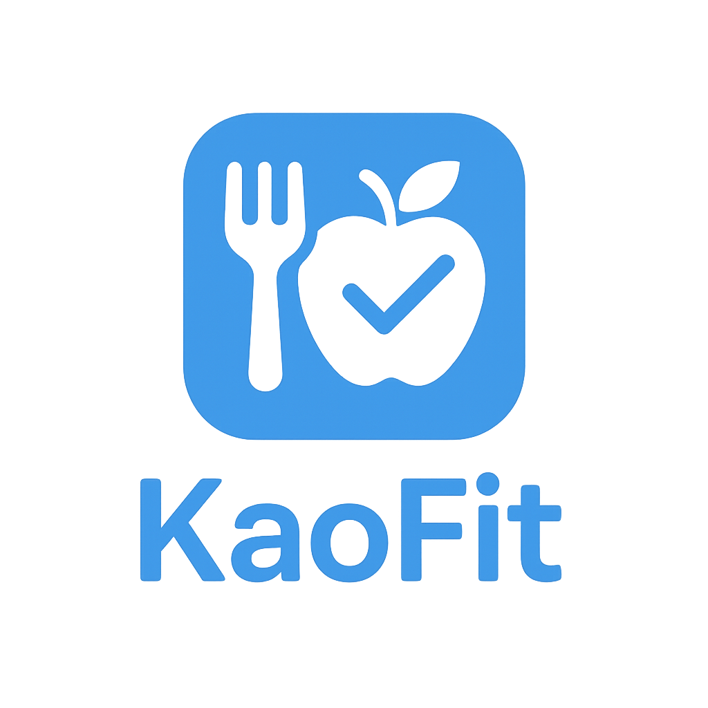
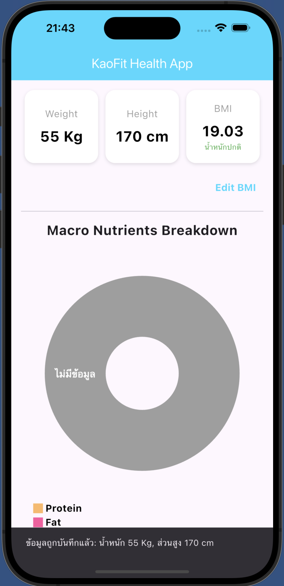
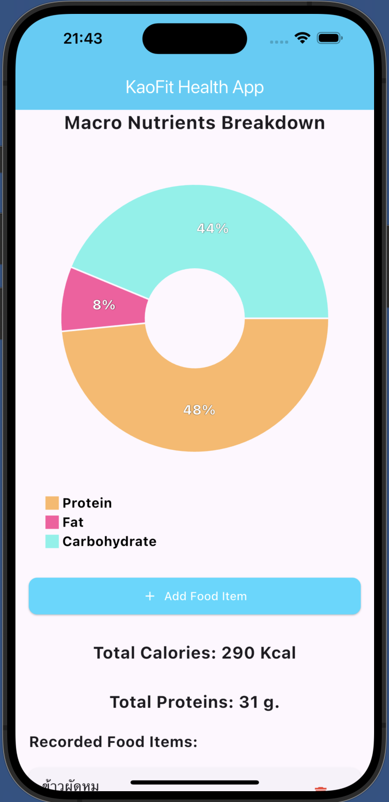
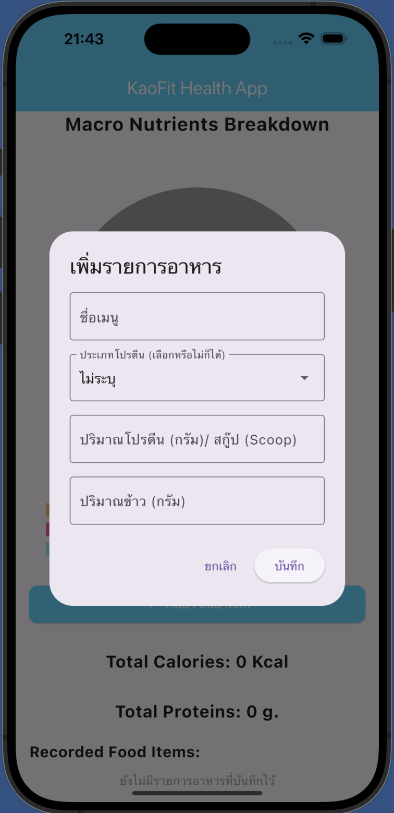

    

# Kaofit: Your Personal Health Companion
 **Kaofit** is an application designed to help you manage your health and diet easily and effectively. Whether you're looking to control your weight, build muscle, or simply improve your overall well-being, Kaofit is here to assist you in achieving your goals with precision.

* Please Note: This Kaofit project was developed as a small-scale application for educational purposes, focusing on understanding the `Dart language`,  `Flutter framework`, `shared_preferences` for data storage, and `ValueNotifier` for state management, as part of learning fundamental mobile application development.

### Key Features
BMI and Health Status Calculation: Simply input your weight and height, and Kaofit will calculate your Body Mass Index (BMI) along with an assessment of your health status, providing a starting point for your self-care plan.

#### Weight and Height Track and Calculate BMI

    

### Macro Nutrient Tracking and Calculation

Popular Food Database: Quickly log your meals from a comprehensive list of popular Thai dishes with complete nutritional information.

Automatic Calculation: The app automatically calculates the total protein, fat, carbohydrates, and calories for your meals, giving you a clear overview of your daily nutrient intake.

Whey Protein in Scoops: For whey protein users, you can directly record your intake in "scoops," making tracking simpler and more accurate.

#### Food and nutrient calculate

#### Protein and carbohydrate

### Data Persistence and Seamless Use

Automatic Saving: Your recorded weight, height, BMI, and meal logs are automatically saved and remain accessible even after closing the app.

User-Friendly Interface: A clean and intuitive interface makes tracking and managing your health data a hassle-free experience.

Who is Kaofit for?
Individuals aiming for weight control, fat loss, or muscle gain.

Anyone looking to track their daily macro nutrient intake.

Those who want to know their BMI and current health status.

People seeking a tool to help plan healthier eating habits.
